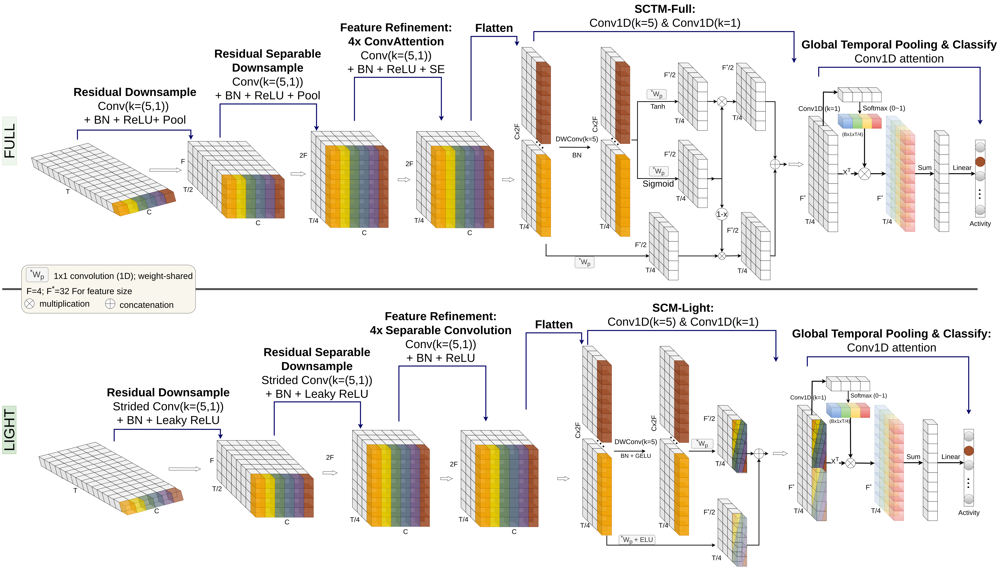
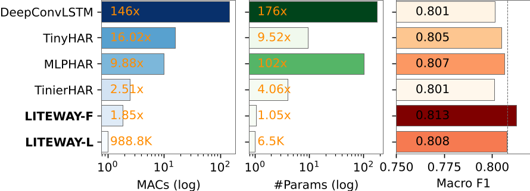
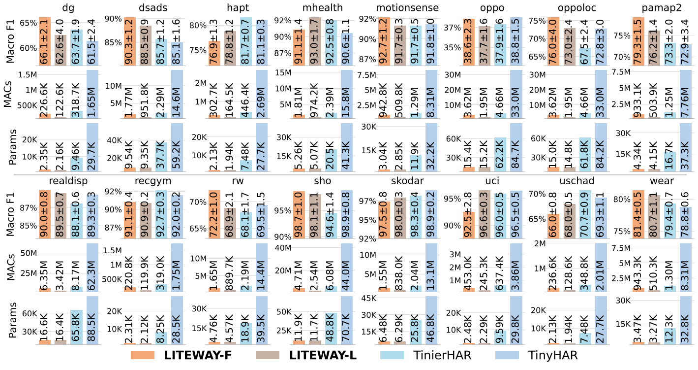

# LITEWAY

>An extra-lightweight, convolution-only network with a single linear layer for human activity recognition

TL;DR:
LITEWAY demonstrates that replacing recurrent HAR architectures with structured convolutions enables highly efficient temporal modeling, achieving strong accuracy while drastically reducing computation, model size, inference time, and energy consumption for real-world TinyML deployment.

The proposed architectures are implemented as:
- [**LITEWAY Full** ](models/LITEWAYfull.py)
- [**LITEWAY Light** ](models/LITEWAYlight.py)

## LITEWAY Framework




## Results Summary Across 16 HAR Datasets (s. details below)




## Comparison of SOTA and LITEWAY on STM32L4S5

| Model  &nbsp; &nbsp; &nbsp; &nbsp; &nbsp; &nbsp;       | Inf. Time (ms) | Weight (KiB) | Activation (KiB) | Cycles/MAC | CPU (% load) | Energy (mJ/Inf) |
|---------------|----------------|--------------|------------------|-------------|---------------|-----------------|
| TinyHAR       | 249.01 | 107.48 | 62.70 | 13.51 | 24 | 19.14 |
| MLPHAR        | 114.81 | 342.41 | 40.54 | 11.99 | 11 | 8.73 |
| TinierHAR     | 81.42 | 39.54 | 14.43 | 25.58 | 8 | 6.36 |
| **LITEWAY-F** | 56.71 | 10.63 | 16.35 | 33.86 | 5 | 4.35 |
| **LITEWAY-L** | 37.44 | 10.07 | 16.03 | 30.54 | 3 | 2.90 |


## Details Results



---
## Experiments and Reproduction

### Datasets

The evaluated HAR datasets can be downloaded using the links provided in the [`datasets/readme`](datasets/readme.md) directory.
<br>
Each dataset should be unzipped and placed in the following structure:
```
datasets/
├── Daphnet_Dataset/
├── DSADS_Dataset/
├── HAPTchar_Dataset/
├── MHEALTH_Dataset/
├── Motionsense_Dataset/
├── Opportunity_Dataset/
├── PAMAP2_Dataset/
├── REALDISP_Dataset/
├── RecGym_Dataset/
├── RWhar_Dataset/
├── SHO_Dataset/
├── SkodaHAR_Dataset/
├── UCIHAR_Dataset/
├── USC_HAD_Dataset/
├── WEAR_Dataset/
└── readme.md
```

---

### Training & Evaluation

Run training using:

```bash
python3 train.py --seeds [SEED] --model [MODEL] --dataset [DATASET]
```

#### Available Models

- `liteway`
- `liteway_light`

#### Example

```bash
python3 train.py --seeds 5 --model liteway --dataset pamap2
```

---

## License

LITEWAY is released under the MIT License. See the [LICENSE](LICENSE) file for details.


### Acknowledgements

We thank the authors of related open-source repositories for providing useful code that were adapted in this work.