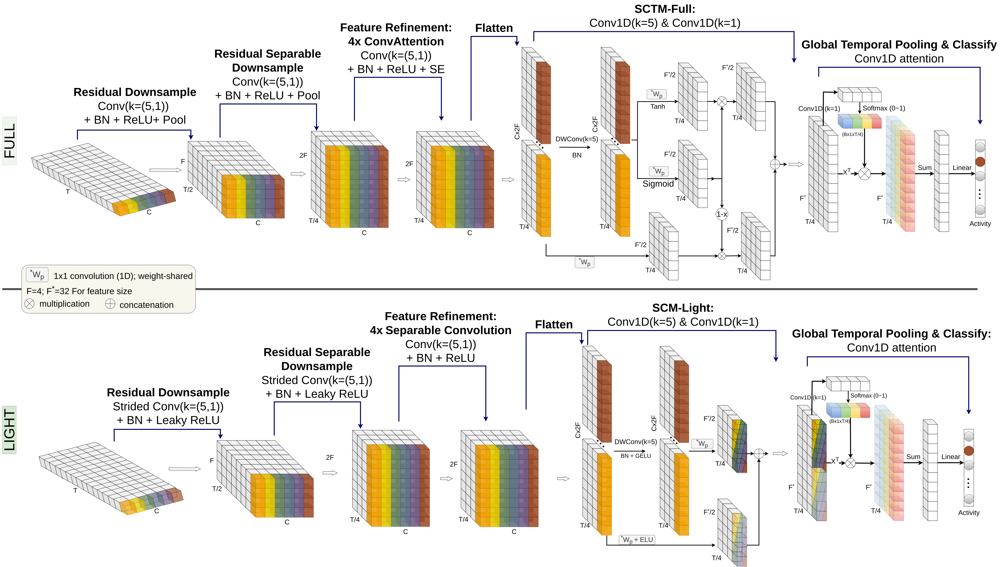
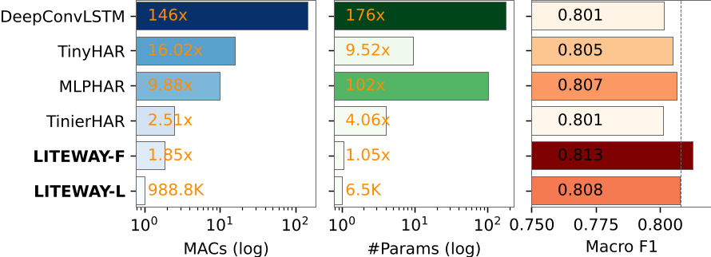
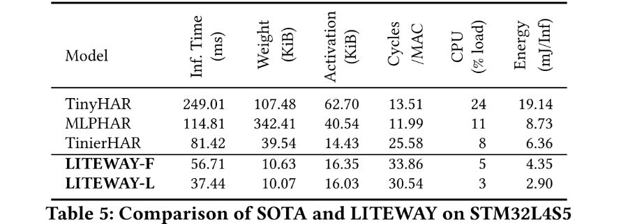
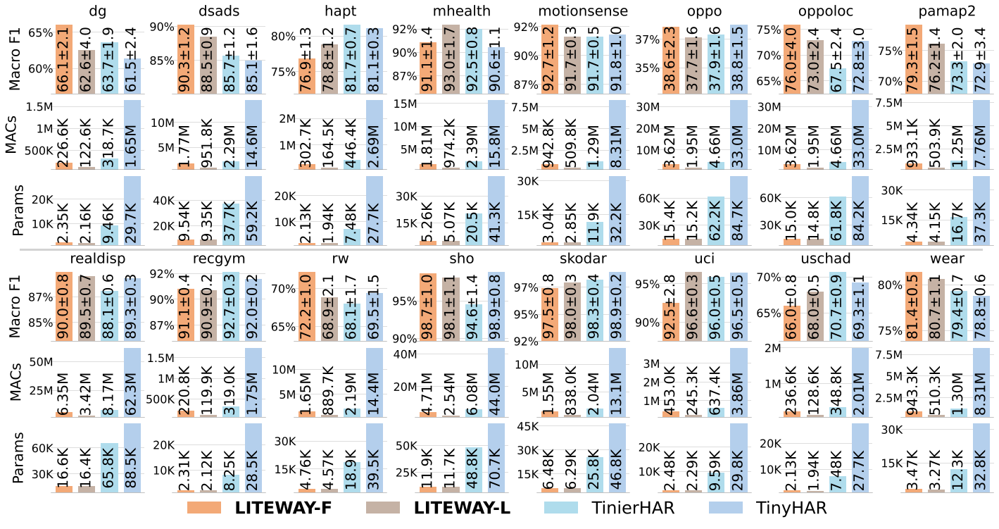

# LITEWAY

>An extra-lightweight, convolution-only network with a single linear layer for human activity recognition

TL;DR:
LITEWAY demonstrates that replacing recurrent HAR architectures with structured convolutions enables highly efficient temporal modeling, achieving strong accuracy while drastically reducing computation, model size, inference time, and energy consumption for real-world TinyML deployment.

The proposed architectures are implemented as: [**LITEWAY Full** ](models/LITEWAYfull.py) and [**LITEWAY Light** ](models/LITEWAYlight.py)

## LITEWAY Framework




## Results Summary Across 16 HAR Datasets <!-- (see below for details of the individual datasets) -->


| Performance | Hardware |
|:---:|:---:|
|  |  |

-

<!--  -->


## Comparison of SOTA and LITEWAY on STM32L4S5

| Model  &nbsp; &nbsp; &nbsp; &nbsp; &nbsp; &nbsp;       | Inf. Time (ms) | Weight (KiB) | Activation (KiB) | Cycles/MAC | CPU (% load) | Energy (mJ/Inf) |
|---------------|----------------|--------------|------------------|-------------|---------------|-----------------|
| TinyHAR       | 249.01 | 107.48 | 62.70 | 13.51 | 24 | 19.14 |
| MLPHAR        | 114.81 | 342.41 | 40.54 | 11.99 | 11 | 8.73 |
| TinierHAR     | 81.42 | 39.54 | 14.43 | 25.58 | 8 | 6.36 |
| **LITEWAY-F** | 56.71 | 10.63 | 16.35 | 33.86 | 5 | 4.35 |
| **LITEWAY-L** | 37.44 | 10.07 | 16.03 | 30.54 | 3 | 2.90 |


## Details Results



---
## Experiments and Reproduction

### Datasets

To download the evaluated HAR datasets and view the repository's data structure organization, please refer to the [`datasets/readme`](datasets/readme.md) file.

---

### Training & Evaluation

Run training using:

```bash
python3 train.py --seeds [SEED] --model [MODEL] --dataset [DATASET]

MODEL: liteway, liteway_light
DATASET: hapt, wear, realdisp, uschad, rw, recgym, motionsense, dsads, oppo, oppoloc, dg, uci, pamap2, skodar, mhealth, sho
SEED: 1, 2, 3, 4, 5.
```

<!-- Models:`liteway`, `liteway_light` <br>
Datasets: `hapt`, `wear`, `realdisp`, `uschad`, `rw`, `recgym`, `motionsense`, `dsads`, `oppo`, `oppoloc`, `dg`, `uci`, `pamap2`, `skodar`, `mhealth`, `sho`
-->

#### Example

```bash
python3 train.py --seeds 5 --model liteway --dataset pamap2
```

---

## License

LITEWAY is released under the MIT License. See the [LICENSE](LICENSE) file for details.


### Acknowledgements

We thank the authors of [TinyHAR](https://doi.org/10.1145/3544794.3558467) open-source repositories for providing useful code that were adapted in this work.
